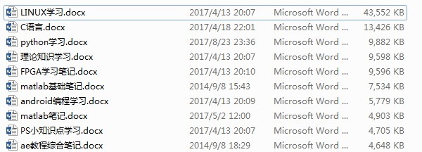
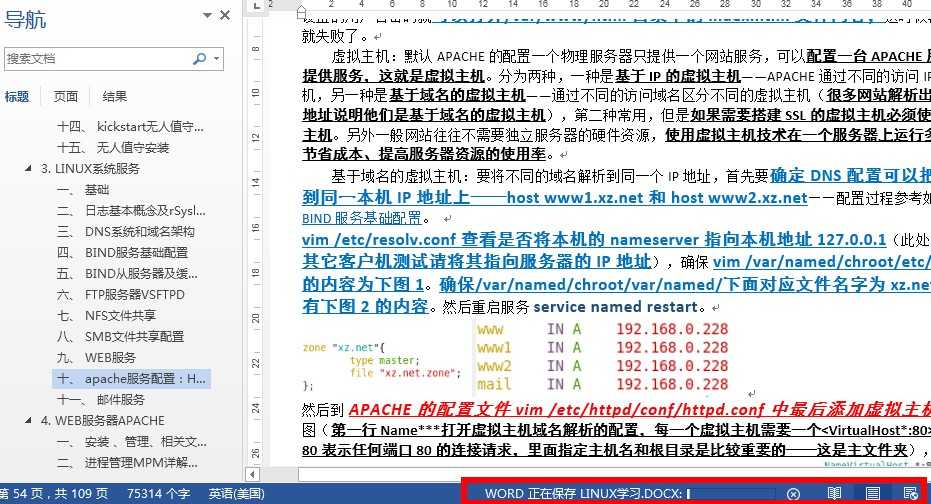
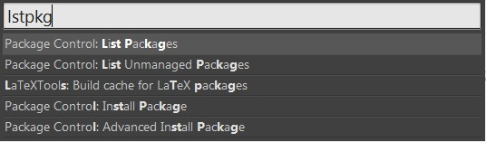
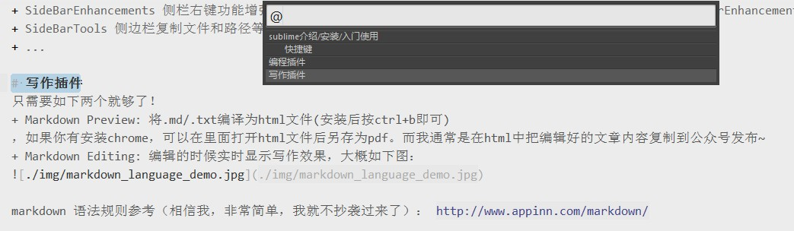

[TOC]

> 以前我都是使用word去记笔记，因为排版、样式、目录等功能用起来感觉很方便，直到后来我的笔记越写越多，用起来越来越卡。每次新增内容保存都要几分钟，才几万字就卡得要死，而且每次打开巨慢无比，严重影响了记笔记的兴趣。大家感受下
 

> 最后终于忍无可忍，决定换一个软件。当时正好了解到非常火爆的 markdown 语法，据说写作如行云流水般顺畅，语法也非常简单；说也巧，那时的我正在痴迷于 sublime 的强大和便捷，就顺手搜了一下 sublime 有没有 markdown 相关的插件，一搜发现一大堆，随手就安装了两个，发现使用起来非常简单方便！

# sublime介绍/安装/入门使用
Sublime Text 是一款免费跨平台的具有代码高亮、语法提示、自动完成且反应快速的编辑器软件，不仅具有华丽的界面，还支持插件扩展机制，用她来写代码和文档，绝对是一种享受。相比于难于上手的Vim，浮肿沉重的Eclipse，VS，即便体积轻巧迅速启动的Editplus、Notepad++，在SublimeText面前大略显失色，无疑这款性感无比的编辑器是Coding和Writing最佳的选择，没有之一。
特色：
1. 当文件未保存就可以直接退出程序，下次启动会自动恢复。
2. 自动补全和高亮大部分语言常用编程语言、以及代码块的快速填充。
3. 支持查看图片格式或者16进制方查看所有非文本文件。
4. ...(百度一搜优点一大堆)

软件安装：到官网 http://www.sublimetext.com/ 下载双击安装即可（软件包小到无法置信）。
插件安装：首先需要安装 Package Control ，【菜单 -> tools -> install package control】，然后所有的操作就只需要按下 `ctrl + shift + p`，然后输入例如 `install` 可以安装插件。~~也可以在菜单选择preferences->packages...来安装~~ 因为所有的菜单操作都可以在 `ctrl+shift+p` 下找到，根本不建议专心写代码/文章的时候去动鼠标好伐！！

使用快捷键：入门时只需要记住一个万能快捷键 `CTRL+SHIFT+P` ， 其下会显示所有其它操作以及相应快捷键，输入命令的简称即可（你根本不需要记得单词的全拼，大概记得就可以可以），例如安装插件：

> 很多操作的快捷键我都不会可以去记忆，比如当我要把所有输入的小写字幕转换为大写字母的时候我会 CTRL+SHIFT+P 然后输入 upper 即可，虽然这时候我可以看见他的快捷键其实是 ctrl+k,u 但是脑容量不够懒得记，按下回车就可以了。对于其它的操作也是类似的，我通常都是发挥我的四级英语水平来猜关键词。

## 快捷键
但是我相信大家作为上进的人一定不止步于入门的快捷键，为此我还是总结了工作中常用的进阶快捷键：

+ Ctrl+Shift+P 打开命令面板，ctrl+~打开python命令行窗口。esc可以退出这些窗口。
+ **Ctrl+鼠标左键 可以同时选择要编辑的多处文本， Shift+鼠标右键（或使用鼠标中键）可以用鼠标进行竖向多行选择**
+ **Ctrl+P 打开搜索框。1、输入当前项目中的文件名，快速搜索文件（在输入文件路径的时候，可以/c/u/a/这样的格式匹配来快速找到文件），2、输入@和关键字，查找文件中函数名[CTRL+R]，3、输入：和数字，跳转到文件中该行代码[CTRL+G]，4、输入#和关键字，查找变量名。**
+ **Ctrl+M：光标移动至括号内结束或开始的位置， Ctrl+Shift+M  选择括号内的内容(按住M继续选择父括号)**
+ Ctrl+Shift+M 选择括号内的内容（重复可以继续选择父括号）
+ F3  跳到下一个相同单词，shift+f3 上一个匹配项，ctrl+f3 下一个匹配项
+ CTRL+D选择下一个相同的文本，Alt+F3 选中文本按下快捷键，即可一次性选择全部的相同文本进行同时编辑。
+ Ctrl+L 选择整行(按住L继续选择下行，Ctrl+Shift+D  复制光标所在整行，插入在该行之前，Ctrl+K+K 从光标处开始删除代码至行尾。Ctrl+Shift+K 删除整行。
+ 自动填充数字序列：Ctrl+Shift+P，使用Package Control 安装这个插件 Increment Selection，然后使用Ctrl+Alt+↓ 选择多行，按 End键 跳转到所有选中行行尾，再按Ctrl+Alt+I就实现了在列尾增加自动增长的数字了。
+ Ctrl+KU 改为大写, Ctrl+KL 改为小写
+ Ctrl+/  注释整行(如已选择内容，同“Ctrl+Shift+/”效果)， Ctrl+Shift+/ 注释已选择内容，Ctrl+Alt+/ 块注释，并Focus到首行，写注释说明用的
+ Ctrl+Enter    插入行后， Ctrl+Shift Enter  插入行前
+ alt+shift+w   使用标签包裹一行; 开始输入你想使用的标签,你成功了. 在xml和html编写中比较常用。
+ ctrl+shift+y：计算当前输入的内容结果显示在当前位置，可以鼠标中键选择多个内容同时一起计算。
+ Ctrl+J 合并行（已选择需要合并的多行时）
+ Ctrl+T 词互换，按住CTRL选择两个单词的时候就可以了
+ Ctrl+K+B 开启/关闭侧边栏
+ Ctrl+K+T 折叠属性， Ctrl+K+0 展开所有折叠代码
+ Ctrl+Tab 当前窗口中的标签页切换，Ctrl+PageDown 、Ctrl+PageUp 文件按开启的前后顺序切换
+ Ctrl+F 查找内容， ctrl+shift+F 在文件夹内查找，高级查找
+ Ctrl+Shift+↑可以移动此行代码，与上行互换， Ctrl+Shift+↓可以移动此行代码，与下行互换
+ Ctrl+F2 设置/取消书签，方便在左侧查看和跳转关键位置吧~不知道有啥大用，F2 下一个书签， Shift+F2 跳到上一个书签， CTRL+SHIFT+F2去除所有书签。
+ Alt+Shift+1（非小键盘）窗口分屏，恢复默认1屏，Alt+Shift+2 左右分屏-2列，Alt+Shift+3 左右分屏-3列，Alt+Shift+4 左右分屏-4列，Alt+Shift+5 等分4屏，Alt+Shift+8 垂直分屏-2屏，Alt+Shift+9 垂直分屏-3屏，Ctrl+Shift+分屏序号 将当前焦点页分配到分屏序号页
+ F6 检测语法错误， F9 行排序(按a-z)---慎用（通常是在特定编辑任务的时候用到，比如排序列表）
+ F11 全屏模式，SHIFT+F11无干扰模式。
+ Ctrl+X：剪切行或者选择内容。ctrl+shift+backspace 左侧全部删除，CTRL+delete 右侧全部删除。ctrl+y 重做或重复
+ ctrl+shift+t  重新打开最近关闭文件, ctrl+shift+w 关闭Sublime，关闭所有打开文件，ctrl+shift+n 打开新Sublime界面。
+ ctrl+left 按\w规则移动（跳跃）- 跳过一个词， ctrl+right  按\w规则移动（跳跃）。ctrl+shift+left 按\w规则移动并选择（跳跃） ctrl+shift+right    按\w规则移动并选择（跳跃）。
+ ctrl+alt+up/down 选择多行进行编辑
+ Ctrl+Shift+[  折叠代码， Ctrl+Shift+]  展开代码
+ ctrl+] 缩进，ctrl+[  不缩进
+ 查找面板的快捷键：enter 向后查找，shift+enter 向前查找，alt+enter 查找全部

# 编程插件
根据编程语言可以搜到很多插件，我个人更多是写C/C++/Python，所以就简单推荐几个常用的神器如下：

+ PlainTasks 任务列表操作， ctrl+enter / ctrl+i 新建任务， ctrl+d 完成任务-再次按下取消完成，alt+c 取消任务。 ctrl+shift+r 列举所有@标签，ctrl+shift+U 跳转到网址。更多操作查看器Tutorial帮助，插件很经典也很简单。
+ Colorcoder 高亮所有变量，因此可以极大的简化代码定位。
+ snippet 该插件可以快速插入代码快！目前测试的VHDL、C、MATLAB、verilog、C++、java等语言都可以快速插入大部分语言结构的代码快，很简单的操作，非常爽！他会根据文件的后缀插入对应的代码快。比如快速插入VHDL的entity模型和verilog的always语句，以及C语言的main函数，或者java语言的方法，或者liscence声明。如果没有的话可以安装，调用方式是ctrl+shift+p输入snippet或者输入想要的代码快搜索。
+ AllAutocomplete 可以完成对所有打开的文件中的变量函数自动提示（Sublime自带的可以对当前文件中的变量和函数名进行自动提示）。AllAutocomplete 可以搜索全部打开的标签页，这将极大的简化开发进程。
+ Trimmer 删除不必要的空格。
+ Alignment：让你能对齐你的代码，包括 PHP、CSS 和 Javascript。 代码看起来更简洁和可读，便于编辑。选中要整理的代码段，Ctrl+Alt+A。默认和截图重复，可以修改一下，比如到Preferences->Package Settings->Alignment->Key Bindings – User下面设置一下就可以了。可以赋值Preferences->Package Settings->Alignment->Key Bindings – Default下面的内容修改为CTRL+ALT+=即可，以后按这个快捷键就可以按照等号对齐了。
+ ChineseLocalization 汉化插件，安装之后在系统的帮助下面可以设置系统语言，全面支持多种语言。
+ SublimeTmpl 文件模板，在file菜单下可以看到其目录和快捷键，其setting下可以设置很多模板信息(模板中的个人信息)，安装目录下可以修改模板内容。
+ SideBarEnhancements 侧栏右键功能增强，可以把常用目录拖动到侧边栏方便随时打开。Theme - Nil是一款SideBarEnhancements的皮肤。
+ SideBarTools 侧边栏复制文件和路径等操作工具。
+ ...

# 写作插件
只需要如下两个就够了！

+ Markdown Preview: 将.md/.txt编译为html文件(安装后按ctrl+b即可)，如果你有安装chrome，可以在里面打开html文件后另存为pdf。而我通常是在html中把编辑好的文章内容复制到公众号发布~
+ Markdown Editing: 编辑的时候实时显示写作效果，大概如下图：

> 显示目录的快捷键是 CTRL+R

markdown 语法规则参考（相信我，非常简单，我就不抄袭过来了）： http://www.appinn.com/markdown/ 

> 后记： 当然了，作为一款神器级别的编辑器，还有很多牛bi~的功能，需要自己的开发，网上随便一搜都是别人的神操作。举两个例子：
> + https://www.zhihu.com/question/19976788
> + https://www.cnblogs.com/wangking/p/6001246.html
> + https://www.jianshu.com/p/3cb5c6f2421c

